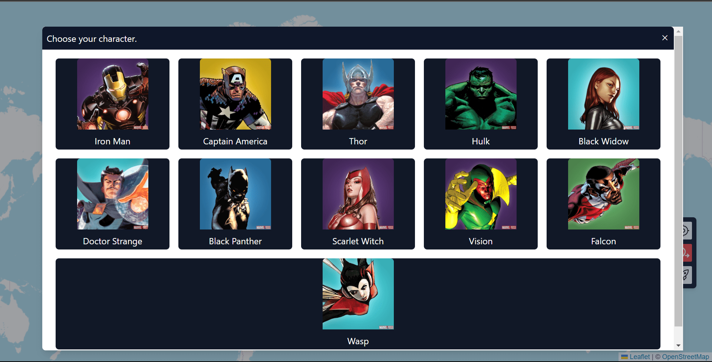
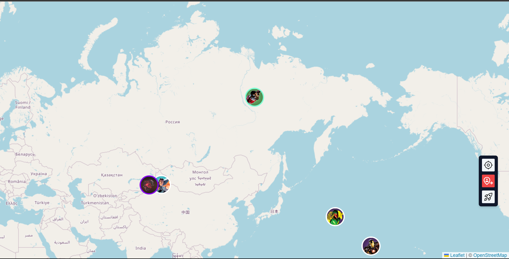
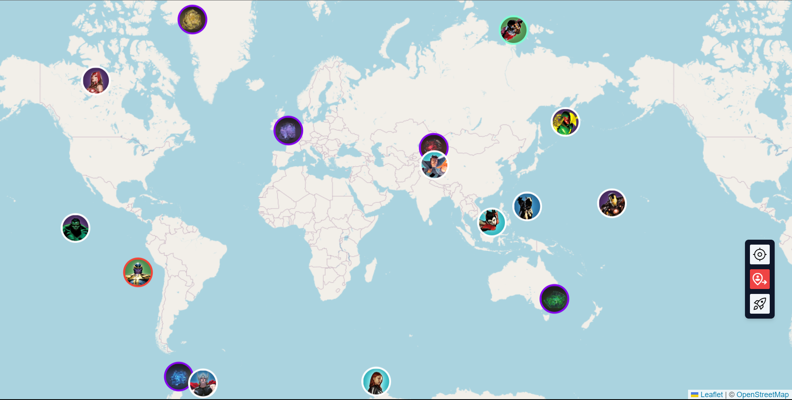
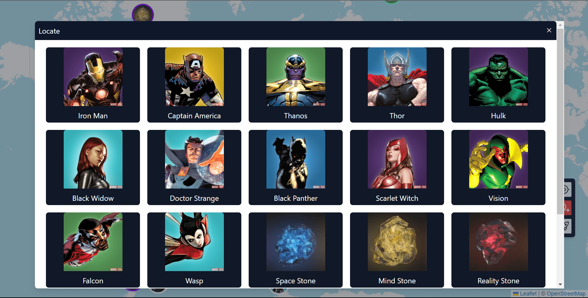
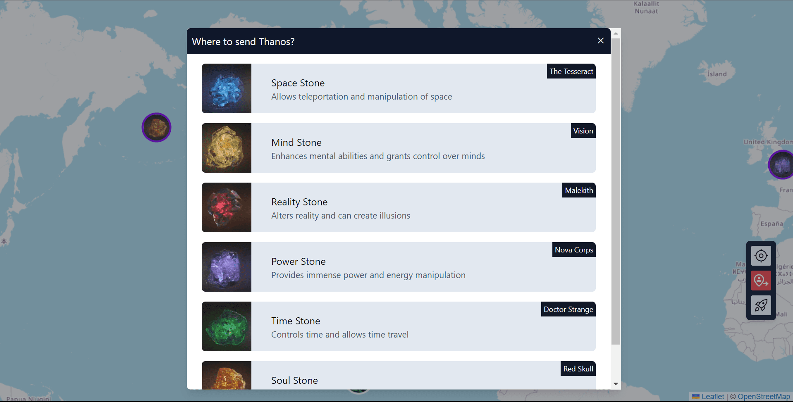
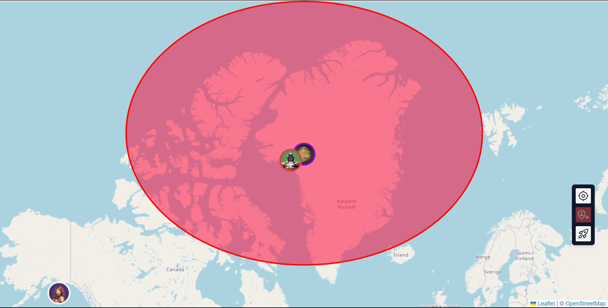
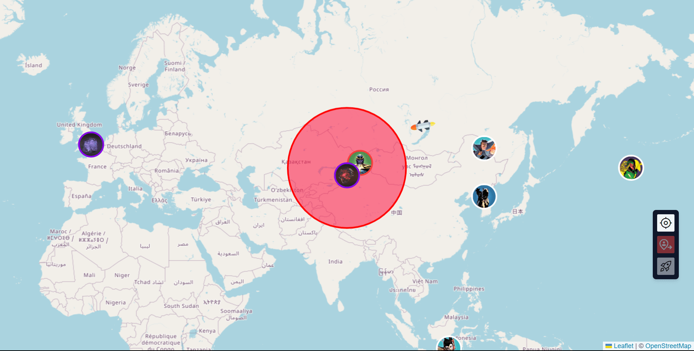
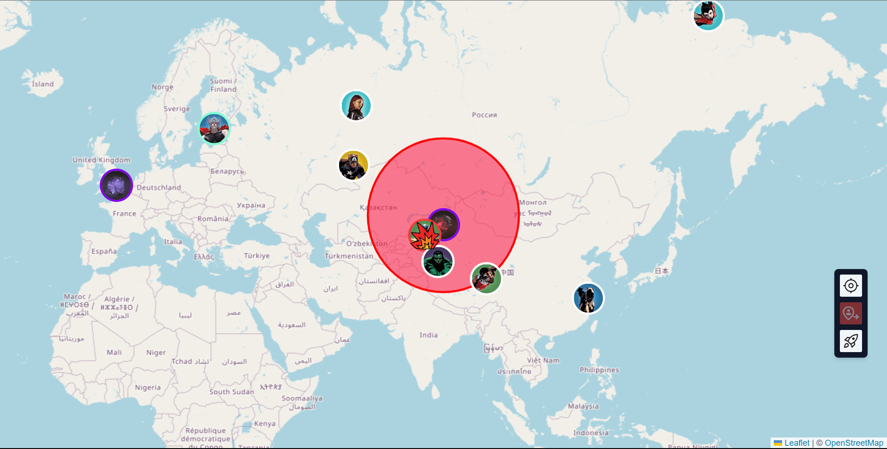

# Avengers Game

This is a README file for the Avengers Game project. The Avengers Game is an interactive web-based game where players can select any Avenger character and engage in a battle against Thanos. The game features a map that displays the Avengers, Thanos, and the Infinity Stones. Thanos moves towards the stones, and if he gets near a stone, a red circle is displayed. The game world is fully interactive, and all clients are synchronized to play the same events.

## Technologies Used

The Avengers Game is built using the following technologies:

- HTML: The markup language used for structuring the web pages.
- CSS: The cascading style sheet used for styling the web pages.
- JavaScript (JS): The programming language used for the game logic and interactivity.
- Tailwind CSS: A utility-first CSS framework used for rapid UI development.
- LeafletJS: A JavaScript library used for displaying the interactive map.
- Google Font Icons: A library of icons used for visual representation.
- Axios: A promise-based HTTP client used for making API requests.
- WebSocket: A protocol used for real-time communication between the server and clients.

The server side of the game is built using the following technologies:

- Express.js: A web application framework for Node.js used to build the server.
- Marvel Developer API: An API provided by Marvel used to fetch Avenger character data.
- WebSocket (ws): A WebSocket library for Node.js used to establish real-time communication with the clients.

## Features

The Avengers Game offers the following features:

1. Character Selection: Players can choose any Avenger character to play the game.
2. Battle Against Thanos: Players engage in a battle with Thanos, the main antagonist.
3. Interactive Map: The game includes a map that displays the Avenger characters, Thanos, and the Infinity Stones.
4. Thanos Movement: Thanos dynamically moves towards the Infinity Stones.
5. Proximity Alert: A red circle is shown if Thanos gets near an Infinity Stone.
6. Location Tracking: Players can locate and track various elements on the map.
7. Fully Interactive World: The game world is interactive, allowing players to interact with different objects.
8. Mobile Friendly: The game is designed to be mobile-friendly, ensuring a seamless experience on mobile devices.
9. Synchronization: All clients are synchronized, ensuring that they play the same events simultaneously.
10. Player-Controlled Thanos Movement: Players have the ability to make Thanos move near a stone.

## Usage

To run the Avengers Game, follow these steps:

1. Clone the project repository to your local machine.
2. Navigate to the project directory.
3. Rename the `.env.local` file to `.env`.
4. Open the `.env` file and set any necessary environment variables.
5. Run the appropriate commands to install the project dependencies (e.g., `npm install`).
6. Start the server by running the appropriate command (e.g., `npm start`, `node server.js`, etc.) depending on your setup.
7. Open the `index.html` file in a web browser to run the game client.
8. Access the game in the web browser at the specified URL (e.g., `http://localhost:3000`).

## Acknowledgments

The Avengers Game project acknowledges the following resources and libraries:

- Marvel Developer API: The official API provided by Marvel, which enables fetching Avenger character data.
- Tailwind CSS: A utility-first CSS framework used for quick and responsive UI development.
- LeafletJS: A JavaScript library used for rendering the interactive map in the game.
- Google Font Icons: A library of icons used to enhance the visual representation of the game.

## Sample Screenshots

These images showcase different screenshots from the Avengers Game. Each image represents a different aspect of the game, including character selection, battle against Thanos, the interactive map, and the Infinity Stones. The images provide a visual representation of the game's features and give a glimpse of the gameplay experience.

## License

The Avengers Game is released under the [MIT License](License.md). Feel free to modify and distribute the project according to the terms of the license.
